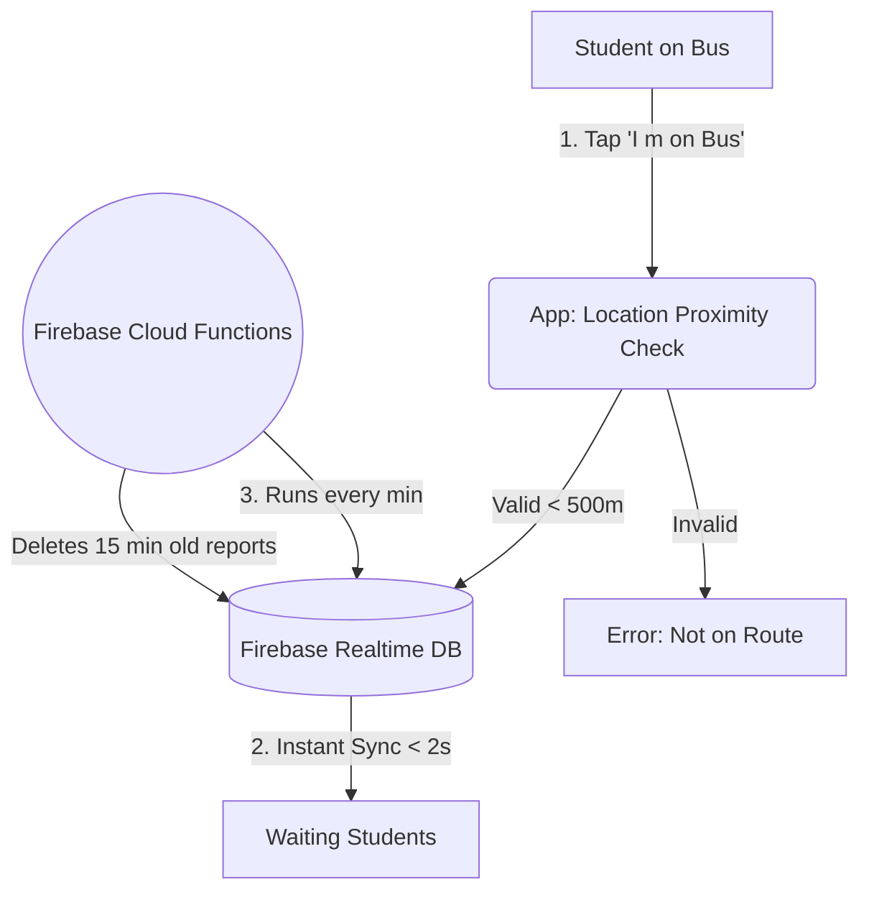

<div align="center">
  
  <h1>🚌 Vidyarthi-Bus</h1>
  <p><em>Crowdsourced Bus Alert System — Eliminate transport uncertainty for rural students.</em></p>

  <!-- Tech Stack Badges -->
  
  
  
  

</div>

<br>

## 📑 Interactive Navigation
* [🎯 The Problem & Solution](#-the-problem--solution)
* [✨ Interactive Feature Tracker](#-interactive-feature-tracker)
* [🏗️ System Architecture](#️-system-architecture)
* [🗄️ Database Schema](#️-database-schema)
* [🗺️ App Usage & User Flow](#️-app-usage--user-flow)
* [🚀 How to Run Locally](#-how-to-run-locally)

---

## 🎯 The Problem & Solution
**The Issue:** Students in remote villages depend entirely on specific college buses. When a bus is full or cancelled, students miss exams due to a lack of real-time crowd visibility.

**The Solution:** Vidyarthi-Bus is a lightweight, crowdsourced Android app. 
1. Students already on the bus report the crowd level with a single tap. 
2. Students waiting at upcoming stops see a live color-coded **"Crowd Meter"** to decide whether to wait or seek an alternative ride.

---

## ✨ Interactive Feature Tracker
*(Click the checkboxes below directly in GitHub to update your progress!)*

### 🚀 MVP Features
- [x] **Secure Login:** Restrict access using Firebase Authentication.
- [x] **Custom UI:** Jetpack Compose Material 3 implementation.
- [ ] **Live Crowd Meter:** Real-time Green/Yellow/Red status bar via Firebase RTDB.
- [ ] **One-Tap Report:** Instantly broadcast bus status to all users.
- [ ] **GPS Proximity Gate:** Validate reporters are within 500m of the bus route.
- [ ] **Alternate Transit:** Show local auto-rickshaw contacts when the bus is red (full).

### 🔮 Post-MVP (Upcoming)
- [ ] **Auto-Expiry:** Cloud Functions remove stale reports after 15 minutes.
- [ ] **Push Notifications:** FCM alerts for bus cancellations.
- [ ] **GenAI Suggestions:** Gemini API integration for alternate route suggestions.

---

## 🏗️ System Architecture

The application follows a clean MVVM (Model-View-ViewModel) architecture to separate the user interface from the Firebase backend logic.

| Layer | Components | Core Technologies |
| :--- | :--- | :--- |
| **Presentation Layer** | LoginScreen, RouteSelectionScreen, DashboardScreen | Jetpack Compose, Material 3 |
| **ViewModel Layer** | AuthViewModel, RouteViewModel, DashboardViewModel | StateFlow, Kotlin Coroutines |
| **Repository Layer** | AuthRepository, RouteRepository, CrowdRepository | callbackFlow, Firebase Listeners |
| **Service Layer** | LocationService (GPS), FcmService (Push) | Google Play Services, FCM |
| **Firebase Backend** | Realtime Database, Auth, Cloud Functions, FCM | Firebase BaaS |

### 🔄 High-Level Data Flow



---

## 🗄️ Database Schema
To achieve the `< 2 seconds` latency requirement, data is stored in a highly flattened NoSQL JSON structure inside Firebase Realtime Database.

```json
{
  "routes": {
    "route_101": {
      "routeName": "Main Campus to Village A",
      "status": "Yellow", 
      "activeReports": {
        "user_abc123": {
          "timestamp": 16987654321,
          "crowdLevel": "Seats Available" 
        }
      },
      "isCancelled": false,
      "alternateContacts": [
        {"name": "Raju Auto", "phone": "9876543210"}
      ]
    }
  }
}
```

---

## 🗺️ App Usage & User Flow
Based on the core PRD requirements, the app follows a strict, lightweight user flow ensuring actions can be completed in **≤ 3 taps**.

| Step | Action | Component / Service |
| :---: | :--- | :--- |
| **1** | Open app & authenticate via college email | Firebase Auth |
| **2** | Select bus route number from dropdown | Route Selection Screen |
| **3** | View **Crowd Meter** (Green/Yellow/Red bar) | Dashboard / RTDB Listener |
| **4** | Tap *"I'm on the bus"* to report crowd level | One-tap Report Button |
| **5** | System validates reporter's GPS proximity | Google Fused Location API |
| **6** | Status broadcasts to all users on route | Firebase Realtime DB |
| **7** | If bus is full, view alternate auto contacts | Alternatives Screen |

### 🔐 Security & Data Integrity
* **Authentication Gate:** Firebase Security Rules block unauthenticated read/write access (Zero public writes).
* **Proximity Gate:** The app locally calculates the distance between the device's GPS and the bus route. Reports `> 500m` away are rejected to prevent fraudulent data.
* **Auto-Purge (TTL):** A Node.js Firebase Cloud Function acts as a garbage collector, enforcing a strict 15-minute Time-To-Live (TTL) on all crowd reports so the dashboard only reflects live conditions.

---

## 🚀 How to Run Locally

<details>
<summary><b>🔥 Click here to expand the Setup Instructions</b></summary>

### Prerequisites
1. Android Studio (Latest Version)
2. A free Firebase Account

### Installation
1. Clone the repository:
   ```sh
   git clone https://github.com/Madhu2150/VidyarthiBus.git
   ```
2. Open the project in **Android Studio**.
3. **Crucial Step:** This app relies on Firebase. You must create your own Firebase project and generate a `google-services.json` file.
4. Place the `google-services.json` file inside the `app/` directory.
5. Click **Sync Project with Gradle Files**.
6. Hit **Run** (Shift + F10) to launch the app on your emulator or physical device.

</details>

---

